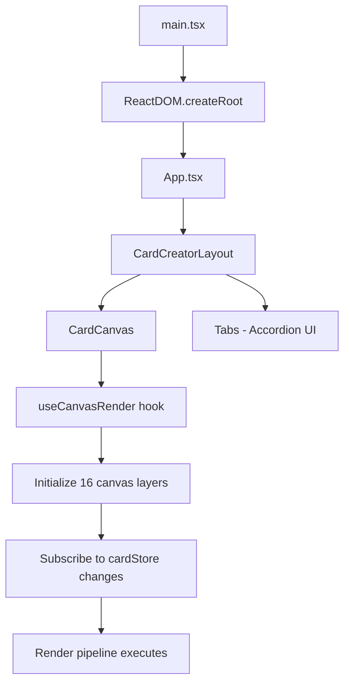

# Card Cipherist - Comprehensive Technical Analysis
**Generated:** November 14, 2025
**Codebase Version:** v0.0.1a
**Analysis Depth:** Senior Developer Level

---

## Executive Summary

**Card Cipherist** is a modern, well-architected React + TypeScript + Electron application that serves as a local resurrection of the original Card Conjurer Magic: The Gathering card creator. The codebase is **already modernized** and demonstrates professional-grade patterns, making it production-ready with minimal refactoring needed.

**Key Findings:**
- ✅ **Already uses modern React + TypeScript** (not a legacy codebase)
- ✅ **Well-structured state management** using Zustand
- ✅ **Component-based architecture** with custom hooks
- ✅ **Comprehensive type safety** with TypeScript strict mode
- ⚠️ **Some opportunities** for further optimization and modularization
- 📦 **~7,400 lines of TypeScript code** across 84+ frame pack files

---

## 1. High-Level Architecture Overview

### Purpose
Card Cipherist is a desktop/web application for creating custom Magic: The Gathering cards with professional-quality templates, supporting 60+ frame styles (regular frames, sagas, planeswalkers, tokens, showcases, etc.).

### Tech Stack
```
Frontend:     React 18.3.1 + TypeScript 5.2.2
State:        Zustand 5.0.8 (with persist + devtools middleware)
UI Library:   Chakra UI 3.27.0 + Emotion
Build Tool:   Vite 5.1.6
Desktop:      Electron 30.0.1
Rendering:    HTML5 Canvas API (multiple compositing layers)
Animation:    Framer Motion 12.23.22
```

### Architecture Pattern
**Layered Architecture with Functional Components:**
```
┌─────────────────────────────────────────┐
│  Presentation Layer (React Components)  │
│  - CardCreatorLayout                     │
│  - Tabs (Frame, Text, Art, etc.)        │
│  - CardCanvas (display only)            │
└─────────────────────────────────────────┘
                    ↓
┌─────────────────────────────────────────┐
│  State Management (Zustand)             │
│  - cardStore (single source of truth)   │
│  - Persisted to localStorage             │
└─────────────────────────────────────────┘
                    ↓
┌─────────────────────────────────────────┐
│  Business Logic (Custom Hooks)          │
│  - useCanvasRender (rendering pipeline) │
│  - useTextFieldRenderer                 │
│  - useImageLoader, useCanvasDrag        │
└─────────────────────────────────────────┘
                    ↓
┌─────────────────────────────────────────┐
│  Rendering Engine (Canvas Utilities)    │
│  - Multi-layer canvas compositing       │
│  - Frame masking & blending             │
│  - Text rendering with mana symbols     │
└─────────────────────────────────────────┘
```

---

## 2. File Map & Responsibilities

### Root Configuration
| File | Purpose |
|------|---------|
| `package.json` | Dependencies, scripts (dev, build, lint) |
| `tsconfig.json` | TypeScript config (strict mode, React JSX) |
| `vite.config.ts` | Vite bundler + Electron pipeline |
| `electron-builder.json5` | Electron packaging configuration |
| `.eslintrc.cjs` | ESLint rules for TS/React |

### Source Structure (`src/`)
```
src/
├── main.tsx                    # React entry point
├── App.tsx                     # Root component (renders CardCreatorLayout)
├── index.css                   # Global styles
├── components/
│   ├── CardCreatorLayout.tsx   # Main layout with accordion tabs
│   ├── CardCanvas.tsx          # Canvas display component
│   ├── CreatorMenu.tsx         # (Unused?) Top menu
│   ├── FrameLayerEditor.tsx    # Frame layer manipulation UI
│   ├── tabs/                   # Feature-specific UI panels
│   │   ├── ScryfallImportTab.tsx
│   │   ├── FrameTab.tsx
│   │   ├── TextTab.tsx
│   │   ├── SagaTab.tsx
│   │   ├── PlaneswalkerTab.tsx
│   │   ├── KamigawaTab.tsx
│   │   ├── StationsTab.tsx
│   │   ├── ArtTab.tsx
│   │   ├── SetSymbolTab.tsx
│   │   ├── WatermarkTab.tsx
│   │   ├── CollectorTab.tsx
│   │   └── SaveImportTab.tsx
│   ├── ui/                     # Chakra UI wrapper components
│   │   ├── provider.tsx
│   │   ├── select.tsx
│   │   ├── checkbox.tsx
│   │   ├── slider.tsx
│   │   ├── tooltip.tsx
│   │   └── ...
│   └── frames/
│       ├── FrameLayerList.tsx
│       ├── packs/              # 84 frame pack definitions (TS files)
│       │   ├── packLoader.ts   # Dynamic frame pack loading
│       │   ├── M15Regular.ts
│       │   ├── TokenRegular.ts
│       │   ├── Sagas.ts
│       │   └── ...
│       └── groups/             # Frame pack grouping logic
├── hooks/
│   ├── useCanvasRender.ts      # Main rendering pipeline (900+ lines)
│   ├── useTextFieldRenderer.ts # Text rendering with mana symbols
│   ├── useImageLoader.ts       # Image loading utilities
│   ├── useCanvasDrag.ts        # Drag interactions (unused?)
│   └── useStationManager.ts    # Station card type manager
├── store/
│   └── cardStore.ts            # Zustand state store (960+ lines)
├── types/
│   └── card.types.ts           # TypeScript interfaces (360+ lines)
├── utils/
│   ├── canvasHelpers.ts        # Core canvas drawing functions
│   ├── sagaHelpers.ts          # Saga card rendering
│   ├── planeswalkerHelpers.ts  # Planeswalker rendering
│   ├── stationHelpers.ts       # Station card rendering
│   ├── neoBasics.ts            # Kamigawa frame stretching logic
│   ├── smartQuotes.ts          # Text formatting
│   ├── drawSerialPlate.ts      # Serial number rendering
│   ├── svgCropper.ts           # SVG manipulation
│   └── collectorInfoConfig.ts  # Collector info templates
└── renderer/
    └── text/                   # Text rendering subsystem
```

---

## 3. Core Execution Flow

### Application Initialization


### Rendering Pipeline (useCanvasRender.ts)
The app uses a **multi-layer canvas compositing** system:

```
Canvas Layers (stacked bottom-to-top):
┌────────────────────────────────────────┐
│ 1. art            # Card artwork       │
│ 2. planeswalkerPre # PW decorations    │
│ 3. frame          # Card frame layers  │
│ 4. stationPre     # Station backgrounds│
│ 5. setSymbol      # Set symbol         │
│ 6. stationPost    # Station badges/PT  │
│ 7. watermark      # Watermark overlay  │
│ 8. saga           # Saga chapter icons │
│ 9. text           # Text fields        │
│ 10. planeswalkerPost # PW overlays     │
│ 11. bottomInfo    # Collector info     │
│ 12. guidelines    # Debug guidelines   │
│ 13. preview       # Final composite    │
└────────────────────────────────────────┘
```

**Render Cycle:**
1. **State Change** → Zustand store update
2. **Hook Trigger** → `useCanvasRender` detects change
3. **Layer Drawing** → Each layer renders independently:
   - `drawFrames()` → Composites frame + masks
   - `drawArt()` → Applies transformations (zoom, rotate)
   - `drawTextLayer()` → Renders mana symbols + text
   - `drawWatermark()` → Gradient masking effects
   - `drawSaga/Planeswalker()` → Special card types
4. **Final Composite** → All layers → preview canvas
5. **Display Update** → 100ms debounce for performance

### State Flow (Zustand)
```typescript
// User interaction (e.g., add frame)
addFrame(newFrame)
  ↓
// Store update with derived calculations
set((state) => ({
  card: {
    ...state.card,
    frames: [...frames, newFrame],
    marginX: calculateRequiredMargins(...), // Auto-compute margins
    marginY: ...
  }
}))
  ↓
// Persistence (selective)
partialize() → Save to localStorage
  ↓
// React re-render
useCardStore(state => state.card.frames) → Component updates
  ↓
// Canvas re-render
useEffect → render() → Canvas updates
```

---

## 4. State Management Deep Dive

### Zustand Store Architecture (`cardStore.ts`)

**State Structure:**
```typescript
interface CardState {
  // Core Data
  card: Card                    // Main card object (~50 properties)

  // UI State
  selectedFrameIndex: number    // Currently selected frame layer
  currentTab: string            // Active accordion tab
  showGuidelines: boolean       // Debug mode
  availableFrames: FrameOption[] // Loaded frame pack

  // Editor State
  isFrameEditorOpen: boolean    // Frame editor modal
  editingFrameIndex: number | null

  // Feature Flags
  hasShownSagaTab: boolean      // Conditional UI rendering
  hasShownPlaneswalkerTab: boolean

  // Non-Persisted (ephemeral)
  artImage: HTMLImageElement | null
  previewCanvasRef: HTMLCanvasElement | null

  // Actions (50+ methods)
  updateCard, addFrame, removeFrame, updateText, ...
}
```

**Key Patterns:**
1. **Immutable Updates:** All mutations use spread operators
2. **Derived State:** Margins auto-calculated from frame bounds
3. **Selective Persistence:** Only `card` metadata saved, not images/canvases
4. **Devtools Integration:** Redux DevTools for debugging
5. **Middleware Composition:** `devtools(persist(store))`

**Example State Update:**
```typescript
// Add frame + recalculate margins
addFrame: (frame) => {
  set((state) => {
    const newFrames = [...state.card.frames, frame];
    const { marginX, marginY } = calculateRequiredMargins(newFrames);

    return {
      card: {
        ...state.card,
        frames: newFrames,
        marginX,
        marginY,
      },
    };
  });
},
```

---

## 5. File Dependencies & Coupling

### Import Graph (Major Dependencies)
```
CardCreatorLayout.tsx
  ↓ imports
  ├── CardCanvas.tsx
  │     ↓ imports
  │     ├── useCanvasRender (hook)
  │     │     ↓ imports
  │     │     ├── canvasHelpers.ts
  │     │     ├── sagaHelpers.ts
  │     │     ├── planeswalkerHelpers.ts
  │     │     ├── stationHelpers.ts
  │     │     └── drawSerialPlate.ts
  │     └── useCardStore (store)
  │
  ├── Tabs (15+ components)
  │     ↓ all import
  │     ├── useCardStore
  │     └── Chakra UI components
  │
  └── useCardStore (global state)
        ↓ imports
        └── card.types.ts

Frame Packs
  ↓ import
  ├── types (FramePackTemplate)
  └── exported as modules (packLoader.ts)
```

### Coupling Analysis

#### ✅ **Loose Coupling (Good)**
- **Components ↔ Store:** All components use Zustand selectors (no prop drilling)
- **Frame Packs:** Dynamically loaded, independent modules
- **Utilities:** Pure functions with no external dependencies

#### ⚠️ **Moderate Coupling (Acceptable)**
- **useCanvasRender ↔ Store:** Tightly coupled but necessary for rendering
- **Tabs ↔ Store:** Direct store access (standard for state managers)
- **Helpers ↔ Canvas API:** Tied to HTML5 Canvas (acceptable for rendering engine)

#### ❌ **Tight Coupling (Areas for Improvement)**
- **Global State Access:** Many components directly call `useCardStore.getState()` instead of selectors
  - Example: `useCardStore.getState().card.frames` (in hooks)
  - Risk: Harder to test, bypasses React rendering optimizations
- **Magic Strings:** Tab names, field keys hardcoded
  - Example: `currentTab: 'frame'`, `fieldKey: 'mana'`
- **DOM State:** Some canvas refs stored in global store (mixing concerns)

---

## 6. Implicit Coupling & Hidden Dependencies

### Global Variables
**None found.** ✅ All state is managed via Zustand or component state.

### Shared DOM State
- **Canvas References:** Stored in `useCanvasRender` ref and Zustand store
  - `previewCanvasRef` in store allows external components to trigger renders
  - Potential issue: Multiple sources of truth (ref + store)

### Overlapping Selectors
- **Frame Visibility:** Stored in `card.frames[i].visible` but also toggled via `toggleFrameVisibility`
  - Could cause inconsistency if manipulated directly

### Module Side Effects
- **Image Loading:** `useImageLoader` hook modifies store directly (setArtImage, etc.)
  - Not technically a side effect, but creates implicit data flow

---

## 7. Modernization Assessment

### Already Modern ✅
The codebase **does NOT** rely on legacy patterns. It's a greenfield TypeScript + React application.

| Legacy Pattern | Status | Notes |
|----------------|--------|-------|
| `document.querySelector` | ❌ Not used | Uses React refs |
| Inline `onclick` | ❌ Not used | React event handlers |
| Global `card` object | ❌ Not used | Zustand store |
| jQuery | ❌ Not present | - |
| Vanilla JS DOM manipulation | ❌ Minimal | Only for Canvas API |
| Class components | ❌ None | All functional components |
| PropTypes | ❌ None | TypeScript for type safety |

### TypeScript Usage
**Strict mode enabled** (`tsconfig.json`):
```json
{
  "strict": true,
  "noUnusedLocals": true,
  "noUnusedParameters": true,
  "noFallthroughCasesInSwitch": true
}
```

**Type Coverage:**
- ✅ All components typed
- ✅ Store actions typed
- ✅ Utility functions typed
- ⚠️ Some `any` types in canvas rendering (acceptable for Canvas API)

### React Patterns
- ✅ Functional components with hooks
- ✅ Custom hooks for logic reuse
- ✅ Context-free (Zustand instead of Context API)
- ✅ Proper dependency arrays in `useEffect`/`useCallback`

---

## 8. Opportunities for Further Modernization

### High Priority

#### 1. **Extract Magic Strings to Constants**
**Current:**
```typescript
// Scattered throughout codebase
setCurrentTab('frame')
card.text?.['mana']
if (card.version === 'neoBasics')
```

**Recommended:**
```typescript
// src/constants/tabs.ts
export const TABS = {
  SCRYFALL: 'scryfall',
  FRAME: 'frame',
  TEXT: 'text',
  // ...
} as const;

// src/constants/textFields.ts
export const TEXT_FIELDS = {
  MANA: 'mana',
  TITLE: 'title',
  TYPE: 'type',
  RULES: 'rules',
  PT: 'pt',
} as const;

// Usage
setCurrentTab(TABS.FRAME);
card.text?.[TEXT_FIELDS.MANA];
```

#### 2. **Split Monolithic Files**
**Files >500 lines:**
- `useCanvasRender.ts` (907 lines) → Split into:
  - `useCanvasLayers.ts` (layer management)
  - `useCanvasComposite.ts` (compositing logic)
  - `useCanvasEffects.ts` (art, watermark, set symbol)
- `cardStore.ts` (964 lines) → Split into:
  - `cardStore.ts` (core store)
  - `cardActions.ts` (action creators)
  - `cardSelectors.ts` (memoized selectors)

#### 3. **Add Unit Tests**
**Currently:** No test files found.
```bash
# Recommended setup
npm install --save-dev vitest @testing-library/react @testing-library/user-event
```

**Test Priorities:**
1. Store actions (pure functions)
2. Utility functions (canvas helpers, formatters)
3. Custom hooks (render logic)
4. Component integration tests

#### 4. **Memoize Expensive Selectors**
```typescript
// Current (recalculates on every render)
const frames = useCardStore(state => state.card.frames);

// Better (with memoization)
import { useShallow } from 'zustand/react/shallow';
const frames = useCardStore(useShallow(state => state.card.frames));
```

#### 5. **Error Boundaries**
Add React error boundaries to prevent full app crashes:
```typescript
// src/components/ErrorBoundary.tsx
class ErrorBoundary extends React.Component {
  componentDidCatch(error, errorInfo) {
    console.error('Canvas render failed:', error);
    // Fallback UI
  }
}
```

---

### Medium Priority

#### 6. **Replace `getState()` with Selectors**
**Anti-pattern (bypasses React):**
```typescript
const currentCard = useCardStore.getState().card;
```

**Better (reactive):**
```typescript
const card = useCardStore(state => state.card);
```

#### 7. **Create Type-Safe Action Creators**
```typescript
// src/store/actions/frameActions.ts
export const createFrameActions = (set: SetState) => ({
  addFrame: (frame: Frame) => {
    set((state) => ({
      card: {
        ...state.card,
        frames: [...state.card.frames, frame],
      },
    }));
  },
});
```

#### 8. **Add JSDoc Comments**
Many complex functions lack documentation:
```typescript
/**
 * Calculates required canvas margins based on frame bounds
 * @param frames - Array of frame layers with bounds
 * @returns {marginX, marginY} - Normalized margin values (0-1)
 */
const calculateRequiredMargins = (frames: Frame[]) => {
  // ...
};
```

#### 9. **Lazy Load Frame Packs**
Currently, all 84 frame packs are bundled. Use dynamic imports:
```typescript
// Before
import M15Regular from './packs/M15Regular';

// After
const loadPack = async (name: string) => {
  const module = await import(`./packs/${name}.ts`);
  return module.default;
};
```

#### 10. **Centralize Canvas Utilities**
Create a `CanvasContext` or service class:
```typescript
// src/services/CanvasRenderer.ts
export class CanvasRenderer {
  private layers: Map<string, HTMLCanvasElement>;

  drawLayer(name: string, drawFn: (ctx) => void) {
    // Centralized drawing logic
  }
}
```

---

### Low Priority

#### 11. **Migrate to CSS Modules**
Current global CSS could conflict in larger apps:
```typescript
// CardCanvas.module.css
.canvas {
  border-radius: 12px;
  box-shadow: 0 4px 20px rgba(0, 0, 0, 0.5);
}

// CardCanvas.tsx
import styles from './CardCanvas.module.css';
<canvas className={styles.canvas} />
```

#### 12. **Add Storybook**
For isolated component development:
```bash
npx sb init
```

#### 13. **Performance Monitoring**
Add React Profiler to identify slow renders:
```typescript
import { Profiler } from 'react';

<Profiler id="CardCanvas" onRender={onRenderCallback}>
  <CardCanvas />
</Profiler>
```

---

## 9. Dependencies Audit

### External Libraries

#### UI & Styling
| Library | Version | Purpose | Notes |
|---------|---------|---------|-------|
| @chakra-ui/react | 3.27.0 | Component library | Well-maintained, modern |
| @emotion/react | 11.14.0 | CSS-in-JS | Chakra dependency |
| framer-motion | 12.23.22 | Animations | Chakra dependency |
| next-themes | 0.4.6 | Dark mode | May be unused (check) |

#### State & Core
| Library | Version | Purpose | Notes |
|---------|---------|---------|-------|
| react | 18.3.1 | UI framework | Latest stable |
| react-dom | 18.3.1 | DOM rendering | Latest stable |
| zustand | 5.0.8 | State management | Lightweight, modern |
| react-icons | 5.5.0 | Icon library | Common choice |

#### Build & Desktop
| Library | Version | Purpose | Notes |
|---------|---------|---------|-------|
| vite | 5.1.6 | Build tool | Modern, fast |
| electron | 30.0.1 | Desktop app | Latest stable |
| typescript | 5.2.2 | Type safety | Latest stable |
| electron-builder | 24.13.3 | Packaging | Standard choice |

### API Dependencies
- **Scryfall API** (`api.scryfall.com`)
  - Card data import
  - No API key required (rate-limited)
  - Fallback: Manual entry

### Asset Dependencies
- **Local Images** (`public/img/`)
  - Frame templates (PNG)
  - Mana symbols (SVG/PNG)
  - Set symbols (SVG)
  - ~3.7GB repository size (mostly images)

### Interaction Flow
```
User Input (Tabs)
  ↓
Store Update (Zustand)
  ↓
Canvas Render (useCanvasRender)
  ↓
Load Assets (public/img/)
  ↓
Composite Layers (Canvas API)
  ↓
Display (CardCanvas component)
```

---

## 10. Migration Opportunities

### Component Modularization

#### Current: Monolithic Tabs
```typescript
// ScryfallImportTab.tsx (300+ lines)
export const ScryfallImportTab = () => {
  // Scryfall fetch logic
  // Form inputs
  // Card preview
  // Import button
  // ...
};
```

#### Refactor: Smaller Components
```typescript
// ScryfallImportTab/index.tsx
export const ScryfallImportTab = () => (
  <VStack>
    <ScryfallSearchForm />
    <ScryfallCardPreview />
    <ScryfallImportButton />
  </VStack>
);

// ScryfallImportTab/ScryfallSearchForm.tsx
export const ScryfallSearchForm = () => { /* ... */ };
```

### Custom Hook Extraction

#### Example: Art Management
```typescript
// hooks/useArtManagement.ts
export const useArtManagement = () => {
  const updateArt = useCardStore(state => state.updateArt);
  const setArtImage = useCardStore(state => state.setArtImage);
  const artImage = useCardStore(state => state.artImage);

  const loadArtFromUrl = async (url: string) => {
    const img = await loadImage(url);
    setArtImage(img);
    updateArt({ artSource: url });
  };

  return { artImage, loadArtFromUrl };
};

// Usage in component
const { loadArtFromUrl } = useArtManagement();
```

### State Slicing

Split Zustand store into feature slices:
```typescript
// store/slices/frameSlice.ts
export const createFrameSlice = (set) => ({
  frames: [],
  addFrame: (frame) => { /* ... */ },
  removeFrame: (index) => { /* ... */ },
});

// store/slices/textSlice.ts
export const createTextSlice = (set) => ({
  text: {},
  updateText: (name, updates) => { /* ... */ },
});

// store/cardStore.ts
export const useCardStore = create()(
  devtools(
    persist(
      (...a) => ({
        ...createFrameSlice(...a),
        ...createTextSlice(...a),
        ...createArtSlice(...a),
      }),
      { name: 'card-store' }
    )
  )
);
```

---

## 11. Security & Best Practices

### Current Security Posture ✅

#### Image Loading
- ✅ **CORS handled:** `crossOrigin = 'anonymous'` on all images
- ✅ **URL validation:** (None - relies on user input)
  - ⚠️ Recommendation: Validate URLs before loading

#### Electron Security
- ✅ **Context isolation:** Enabled (preload script pattern)
- ✅ **No `nodeIntegration`:** Renderer doesn't have Node access
- ⚠️ **No CSP:** Consider adding Content Security Policy

#### Data Persistence
- ✅ **LocalStorage only:** No sensitive data stored
- ⚠️ **No encryption:** Card data stored in plain text (acceptable for this app)

### Recommendations
1. **Add URL validation:**
```typescript
const isValidImageUrl = (url: string) => {
  try {
    const parsed = new URL(url);
    return ['http:', 'https:', 'data:'].includes(parsed.protocol);
  } catch {
    return false;
  }
};
```

2. **Add CSP headers (Electron):**
```typescript
// electron/main.ts
app.on('ready', () => {
  session.defaultSession.webRequest.onHeadersReceived((details, callback) => {
    callback({
      responseHeaders: {
        ...details.responseHeaders,
        'Content-Security-Policy': [
          "default-src 'self'; img-src 'self' data: https:; script-src 'self' 'unsafe-inline'"
        ]
      }
    });
  });
});
```

---

## 12. Performance Analysis

### Current Performance

#### Strengths ✅
- **Debounced rendering:** 100ms delay prevents excessive redraws
- **Canvas-based:** Hardware-accelerated rendering
- **Lazy initialization:** Canvases created on-demand
- **Memoized functions:** `useCallback` used extensively

#### Bottlenecks ⚠️
1. **Large store updates:** Entire `card` object spread on every change
   - Solution: Use Immer middleware for deep updates
2. **No virtualization:** Frame pack list renders all items
   - Solution: Use `react-virtual` for long lists
3. **Image re-loading:** No image cache beyond browser cache
   - Solution: IndexedDB cache for frequently used frames

### Optimization Recommendations

#### 1. Add Immer Middleware
```typescript
import { immer } from 'zustand/middleware/immer';

export const useCardStore = create<CardState>()(
  devtools(
    persist(
      immer((set) => ({
        // Mutations now safe
        addFrame: (frame) => {
          set((draft) => {
            draft.card.frames.push(frame);
          });
        },
      }))
    )
  )
);
```

#### 2. Virtualize Long Lists
```typescript
import { useVirtualizer } from '@tanstack/react-virtual';

const FramePackList = ({ frames }) => {
  const virtualizer = useVirtualizer({
    count: frames.length,
    getScrollElement: () => parentRef.current,
    estimateSize: () => 100,
  });

  return virtualizer.getVirtualItems().map(item => (
    <FramePackItem key={item.key} frame={frames[item.index]} />
  ));
};
```

#### 3. Web Workers for Image Processing
```typescript
// workers/imageProcessor.ts
self.onmessage = (e) => {
  const { imageData, operation } = e.data;
  // Offload expensive transforms
  self.postMessage(processedData);
};
```

---

## 13. Testing Strategy

### Recommended Test Coverage

#### Unit Tests (Utilities)
```typescript
// utils/canvasHelpers.test.ts
import { describe, it, expect } from 'vitest';
import { scaleX, scaleY } from './canvasHelpers';

describe('scaleX', () => {
  it('should scale normalized coordinates to pixels', () => {
    const card = { width: 2010, marginX: 0 };
    expect(scaleX(card, 0.5)).toBe(1005);
  });
});
```

#### Integration Tests (Hooks)
```typescript
// hooks/useCanvasRender.test.ts
import { renderHook } from '@testing-library/react-hooks';
import { useCanvasRender } from './useCanvasRender';

it('should initialize canvases', () => {
  const { result } = renderHook(() => useCanvasRender());
  expect(result.current.canvasRefs.card).toBeDefined();
});
```

#### Component Tests
```typescript
// components/CardCanvas.test.tsx
import { render, screen } from '@testing-library/react';
import { CardCanvas } from './CardCanvas';

it('renders canvas element', () => {
  render(<CardCanvas />);
  const canvas = screen.getByRole('img'); // Canvas has img role
  expect(canvas).toBeInTheDocument();
});
```

#### E2E Tests (Playwright)
```typescript
import { test, expect } from '@playwright/test';

test('create card workflow', async ({ page }) => {
  await page.goto('http://localhost:5173');
  await page.click('text=Frame');
  await page.click('text=M15 Regular');
  // Verify canvas updated
  const canvas = page.locator('canvas');
  await expect(canvas).toBeVisible();
});
```

---

## 14. Prioritized Refactoring Roadmap

### Phase 1: Immediate (1-2 weeks)
- [ ] Extract magic strings to constants
- [ ] Add error boundaries
- [ ] Replace `getState()` with selectors
- [ ] Add JSDoc comments to complex functions
- [ ] Set up Vitest + basic unit tests

### Phase 2: Short-term (1 month)
- [ ] Split `useCanvasRender` into smaller hooks
- [ ] Split `cardStore` into feature slices
- [ ] Add Immer middleware for safer mutations
- [ ] Implement image caching (IndexedDB)
- [ ] Add virtualization to frame pack lists

### Phase 3: Medium-term (2-3 months)
- [ ] Extract tab components into smaller pieces
- [ ] Create custom hooks for feature logic
- [ ] Add Storybook for component development
- [ ] Implement CSP and security headers
- [ ] Add E2E tests for critical workflows

### Phase 4: Long-term (Future)
- [ ] Lazy load frame packs
- [ ] Web Worker for image processing
- [ ] Performance profiling and optimization
- [ ] Accessibility audit (WCAG compliance)
- [ ] Internationalization (i18n) support

---

## 15. Conclusion & Recommendations

### Summary
**Card Cipherist is already a well-structured, modern React + TypeScript application.** It does not suffer from legacy anti-patterns and is production-ready with minor improvements.

### Key Strengths
1. ✅ Modern tech stack (React 18, TypeScript, Zustand, Vite)
2. ✅ Clean separation of concerns (components, hooks, utilities)
3. ✅ Type-safe codebase with strict TypeScript
4. ✅ Professional-grade canvas rendering pipeline
5. ✅ Comprehensive frame template system (84 packs)

### Areas for Improvement
1. ⚠️ Magic strings should be constants
2. ⚠️ Large files need splitting (useCanvasRender, cardStore)
3. ⚠️ No tests (critical gap)
4. ⚠️ Performance optimizations (Immer, virtualization)
5. ⚠️ Documentation (JSDoc, architecture diagrams)

### Final Verdict
**Migration Priority: LOW**
This codebase does **not** need a React/TypeScript migration — it's already there. Focus efforts on:
- **Refactoring** (split large files, extract constants)
- **Testing** (add unit/integration tests)
- **Optimization** (performance tuning)
- **Documentation** (code comments, user guides)

### Recommended Next Steps
1. Set up testing infrastructure (Vitest + React Testing Library)
2. Extract constants for all magic strings
3. Add error boundaries to prevent crashes
4. Split `useCanvasRender` and `cardStore` into smaller modules
5. Implement performance monitoring

---

**Document Version:** 1.0
**Author:** Technical Analysis (Automated)
**Contact:** See repository maintainers for questions
